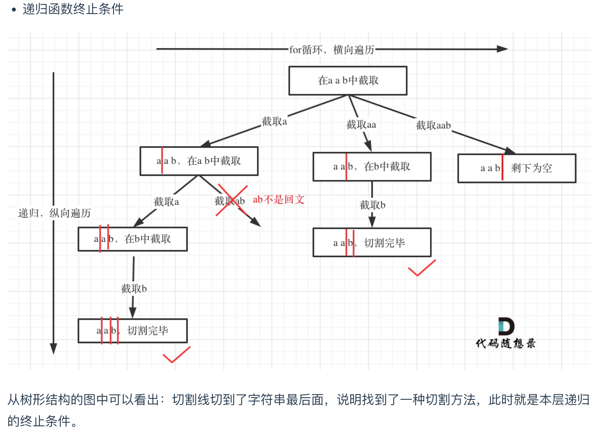

- [代码随想录 Palindrome Partitioning](https://programmercarl.com/0131.%E5%88%86%E5%89%B2%E5%9B%9E%E6%96%87%E4%B8%B2.html#c-%E6%95%B4%E4%BD%93%E4%BB%A3%E7%A0%81)

> 切割问题， 和组合问题很像，注意决策树树枝的定义，以及终止条件的定义
# [Palindrome Partitioning - LeetCode](https://leetcode.com/problems/palindrome-partitioning/description/)

## Tag
#Partioning, #Palindrome

## 审题（关键词） 
Palindrome, Partioning


## 初始思路  
跟组合问题有点像，求子串是否是回文，
那么第一步肯定是找到子串：
	如何找到子串：
		用for循环无限嵌套？
		- 可以用回溯的思路，转换为决策树。树枝选择在字符串哪里切割
第二步是判断回文，比较简单，双指针即可。


## 考点  
回溯算法


## 解法  


```java
class Solution {
    public List<List<String>> partition(String s) {
        List<String> path = new ArrayList<>();
        List<List<String>> ans = new ArrayList<>();

        backtracking(s, path, ans, 0);
        return ans;
    }

    void backtracking(String s, List<String> path, List<List<String>> ans, int startIndex) {
        // bc;
        // 叶子节点找到一个分割方式
        if (startIndex >= s.length()) {
            ans.add(new ArrayList<>(path));
            return ;
        }

        for(int i = startIndex; i < s.length(); i++) {

            // 找到一个回文子串
            if (isPalindrome(s, startIndex, i)) {
                // pre-process:
                path.add(s.substring(startIndex, i + 1));
                // recursion:
                backtracking(s, path, ans, i + 1);
                // post-process
                path.remove(path.size() - 1);
            } else {
                // 没有找到回文子串，继续下一个子串
                continue;
            }
        }
    }

    boolean isPalindrome(String s, int startIndex, int end) {
        for (int i = startIndex, j = end; i < j; i++, j--) {
            if (s.charAt(i) != s.charAt(j)) {
                return false;
            }
        }
        return true;
    }
}
```

## 难点
- 如何想到回溯：for循环过多嵌套
- 决策树的树枝定义：切割点
- for循环：找切割终止点，发现一个回文子串时，先将其加入到 path 中，然后进行递归，最后再从 path 中移除。如果不是回文子串，那么应该直接跳过，不进行递归。
- 终止条件：到树叶节点
