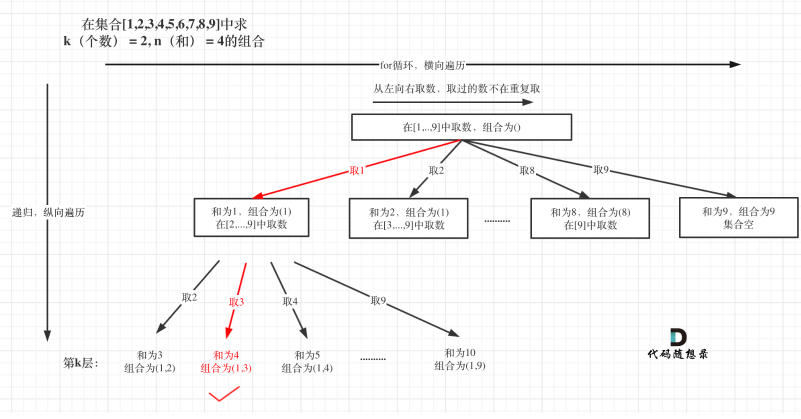

# [Combination Sum III - LeetCode](https://leetcode.com/problems/combination-sum-iii/description/)


## Tag
#backtracking, #combination

## 审题（关键词）
所有为k的，sum为n的组合：
只有1到9


## 初始思路  
思考决策树：跟77一样  
终止条件更新一个：n为0添加答案。  


## 考点  
回溯， 组合。


## 解法  

```java
class Solution {
    public List<List<Integer>> combinationSum3(int k, int n) {
        // combination
        // 参数和返回：路径列表，k， n， startIndex, 答案
        // 终止：路径列表size = k， n == 0加入答案
        // 遍历：for 循环1-9， n减i
        List<List<Integer>> ans = new ArrayList<>();
        List<Integer> path = new ArrayList<>();
        backtracking(1, k, n, path, ans);
        return ans;
    }

    private void backtracking(int startIndex, int k, int n, List<Integer> path, List<List<Integer>> ans) {
        // bc: 
        if (path.size() == k) {
            // update answer if the n equal to 0.
            if (n == 0) {
                ans.add(new ArrayList<>(path));
            }
            return ;
        }

        // 访问：
        for (int i = startIndex; i <= 9; i++) {
            // 前序处理（树枝）：update path, startIndex；
            path.add(i);

            // 递归：访问接下来的决策树
            backtracking(i + 1, k, n - i, path, ans);

            // 后序处理（树枝）：回溯
            path.remove(path.size() - 1);
        }
    }
}
```
> 剪枝： [代码随想录 216 剪枝](https://programmercarl.com/0216.%E7%BB%84%E5%90%88%E6%80%BB%E5%92%8CIII.html#%E5%89%AA%E6%9E%9D)
```java
class Solution {
    public List<List<Integer>> combinationSum3(int k, int n) {
        // combination
        // 参数和返回：路径列表，k， n， startIndex, 答案
        // 终止：路径列表size = k， n == 0加入答案
        // 遍历：for 循环1-9， n减i
        List<List<Integer>> ans = new ArrayList<>();
        List<Integer> path = new ArrayList<>();
        backtracking(1, k, n, path, ans);
        return ans;
    }

    private void backtracking(int startIndex, int k, int n, List<Integer> path, List<List<Integer>> ans) {
        // bc: 
        if (path.size() == k) {
            // update answer if the n equal to 0.
            if (n == 0) {
                ans.add(new ArrayList<>(path));
            }
            return ;
        }

        // 访问：
        // 剪枝：还有k - path.szie()个选择可以选，所以已经到9 - 可选项值时可以剪枝
        for (int i = startIndex; i <= 9 - (k - path.size()) + 1; i++) {
            // 前序处理（树枝）：update path, startIndex；
            path.add(i);

            // 递归：访问接下来的决策树
            backtracking(i + 1, k, n - i, path, ans);

            // 后序处理（树枝）：回溯
            path.remove(path.size() - 1);
        }
    }
}
```

## 难点
如何想到回溯：需要暴力搜索所有的答案，组合关键词
