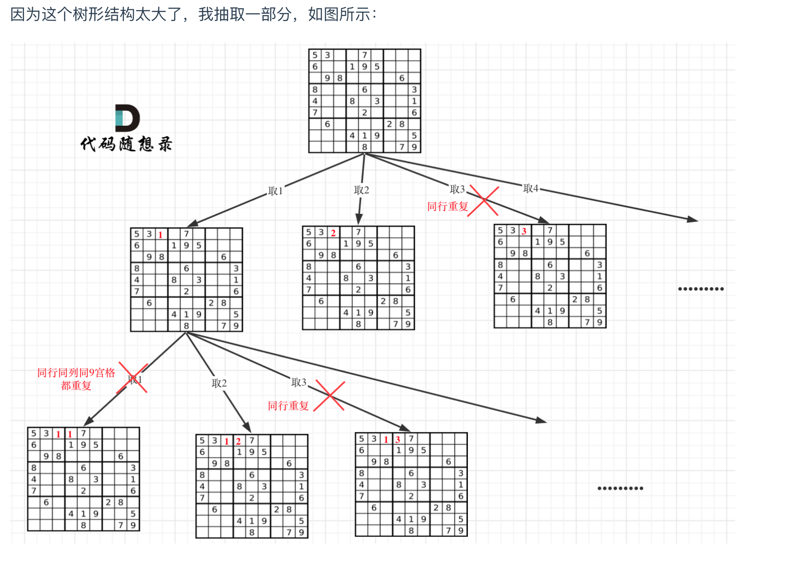

# [Sudoku Solver - LeetCode](https://leetcode.com/problems/sudoku-solver/description/)
> 二维递归
## Tag

## 审题（关键词）
解数独, 找到一个可行解即可返回

## 初始思路  
与N皇后类似，
- 暴力遍历每一行，（for 循环1）
- 这一行中的每一列为"."的，（for 循环2）
- 尝试每一个数字 （for 循环3）

接着本行下一列，
以及下一行
## 考点  

## 解法  

```java
class Solution {
    public void solveSudoku(char[][] board) {
        backtracking(board);
    }

    // 返回值为true，找到一个可行解直接返回
    boolean backtracking(char[][] board) {
        int n = board.length;
        // row: 
        for (int i = 0; i < n; i++) {
            // col: 
            for (int j = 0; j < n; j++) {
                // 已经有数字，不需要再填
                if (board[i][j] != '.') {
                    continue;
                }
                // possible numbers:
                for (char k = '1'; k <= '9'; k++) {
                    // preOrder: 
                    // trim invalid numbers:
                    if (!isValid(board, i, j, k)) {
                        continue;
                    }

                    // update path(board):
                    board[i][j] = k;
                    
                    // recursion:
                    // find one possible result, return answer
                    if (backtracking(board)) return true;

                    board[i][j] = '.';
                }
                // 剪枝：所有的数字都不行
                return false;
            }
        }

        return true;
    }

    boolean isValid(char[][] board, int row, int col, char num) {
        int n = board.length;
        for (int i = 0; i < n; i++) {
            if (board[i][col] == num || board[row][i] == num) {
                return false;
            }
        }

        int startRow = (row/3) * 3;
        int startCol = (col/3) * 3;

        // 判断9方格里是否重复
        for (int i = startRow; i < startRow + 3; i++) { 
            for (int j = startCol; j < startCol + 3; j++) {
                if (board[i][j] == num ) {
                    return false;
                }
            }
        }

        return true;
    }
}
```

## 难点
- 直接用boolean 返回，因为只需要找到一个可能答案。
- Return false 是在这个位置试了9个数字之后，如果都不行返回false，可以剪枝，不会陷入死循环无限递归。
- 可以直接用char做for loop
```java
(char k = '1'; k <= '9'; k++)
```
> 判断9宫格
```java
	int startRow = (row/3) * 3;
	int startCol = (col/3) * 3;

	// 判断9方格里是否重复
	for (int i = startRow; i < startRow + 3; i++) { 
			for (int j = startCol; j < startCol + 3; j++) {
					if (board[i][j] == num ) {
							return false;
					}
			}
	}
	```
