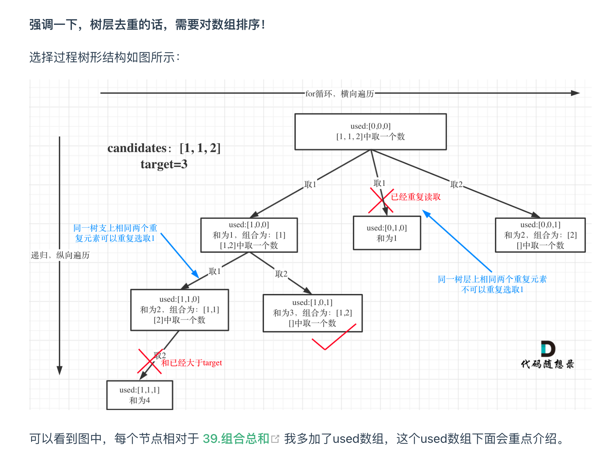

> 学习组合中（回溯）去重的思路

- [代码随想录 40. Combination Sum II](https://programmercarl.com/0040.%E7%BB%84%E5%90%88%E6%80%BB%E5%92%8CII.html#%E5%9B%9E%E6%BA%AF%E4%B8%89%E9%83%A8%E6%9B%B2)
# [Combination Sum II - LeetCode](https://leetcode.com/problems/combination-sum-ii/description/)

## Tag
#combination, #backtracking

## 审题
Combination Sum, Duplicate, 

## 初始想法
与[[77. Combinations]]类似，只不过多了去重！
如何去重？关键在于树层去重！
- 树层去重
    树层上不能取值相同的元素
- 树枝去重
    树枝上可以取值相同的元素
    
```
    代码上使用used数组
    比较i和i-1的相等时，看used i-1是0还是1
        1表示之前用过一个重复元素，是树枝上，不需要去重
        0表示在树层上，需要去重
```
		

## solution
```java
class Solution {
    public List<List<Integer>> combinationSum2(int[] candidates, int target) {
        List<List<Integer>> ans = new ArrayList<>();
        List<Integer> path = new ArrayList<>();
        // 排序保证相同的元素相邻，从而可以进行树层去重的逻辑验证
        Arrays.sort(candidates);
        boolean[] used = new boolean[candidates.length];

        // parmas：
        // ans: 最终答案
        // path: 记录路径
        // startIndex: 递归深度，记录candidates中的递归起始点， （for循环的起始位置）
        // used: 使用used判断元素是否被取用过，从而进行树枝去重
        backTracking(candidates, target, ans, path, 0, used);

        return ans;
    }

    void  backTracking(
        int[] candidates, 
        int target, 
        List<List<Integer>> ans, 
        List<Integer> path, 
        int startIndex,
        boolean[] used) {
            // BC:
            if (target == 0) {
                ans.add(new ArrayList<>(path));
                return ;
            }

            // recursion:
            for (int i = startIndex; i < candidates.length; i++) {
                // 剪枝
                if (target < 0) {
                    break;
                }
                // 树层去重：
                if(i > 0 && candidates[i] == candidates[i - 1] && !used[i - 1]) {
                    continue;
                }

                // pre-handle:
                // 进入节点：更新路径和状态
                path.add(candidates[i]);
                target -= candidates[i];
                used[i] = true;
                
                backTracking(candidates, target, ans, path, i + 1, used);
                
                // post-handle
                // 离开节点：回溯维护状态
                used[i] = false;
                target += candidates[i];
                path.remove(path.size() - 1);
            }

        }
}
```

> 或者使用startIndex:
```java
 for (int i = startIndex; i < candidates.size() && sum + candidates[i] <= target; i++) {
            // 要对同一树层使用过的元素进行跳过
            if (i > startIndex && candidates[i] == candidates[i - 1]) {
                continue;
            }
            sum += candidates[i];
            path.push_back(candidates[i]);
            backtracking(candidates, target, sum, i + 1); // 和39.组合总和的区别1，这里是i+1，每个数字在每个组合中只能使用一次
            sum -= candidates[i];
            path.pop_back();
        }
```

## 难点
难点在于去重