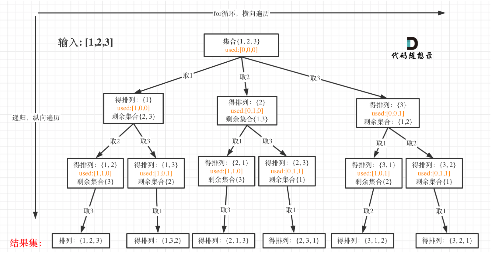

# [Permutations - LeetCode](https://leetcode.com/problems/permutations/description/)
## Tag
#permutations, #backtracking


## 审题（关键词） 
permutations， distinct integers


## 初始思路  
不同顺序也算在全排列中，比如123， 321，  
所以和子集的区别在于，
- 子集需要排除不同顺序，for loop的下一个遍历要从 i + 1开始
- 全排列从0开始，除路径上已经有的元素，其他元素都可以选
  - 不需要startIndex, 取而代之的是boolean数组看是否选过
  - 使用used数组，记录此时path里都有哪些元素使用了，一个排列里一个元素只能使用一次(树枝去重）。

## 考点  
全排列

## 解法  

```java
class Solution {
    public List<List<Integer>> permute(int[] nums) {
        boolean[] used = new boolean[nums.length];
        List<List<Integer>> ans = new ArrayList<>();
        List<Integer> path = new ArrayList<>();

        // 参数：除基本外，使用used数组代替startIndex，
        // 因为本题排列是有序的，这意味着同一层的元素可以重复使用，但同一树枝上不能重复使用
        // 所以处理排列问题每层都需要从头搜索，故不再使用start_index
        backTracking(nums, ans, path, used);
        return ans;
    }

    void backTracking(int[] nums, List<List<Integer>> ans, List<Integer> path, boolean[] used) {
        // 终止：path的长度和nums相等，全排列
        if (nums.length == path.size()) {
            ans.add(new ArrayList<>(path));
        }

        // for loop 遍历选择
        // 选择列表：不在used里的num
        for (int i = 0; i < nums.length; i++) {
            if (!used[i]) {
                // 未被选择过：
                // inOrder:
                // update used and path
                used[i] = true;
                path.add(nums[i]);

                backTracking(nums, ans, path, used);

                // postOrder:
                // backtracking
                path.remove(path.size() - 1);
                used[i] = false;
            } else {
                continue;
            }
        }

    }

}
```

## 难点
全排列的意义，使用used数组确定选择列表