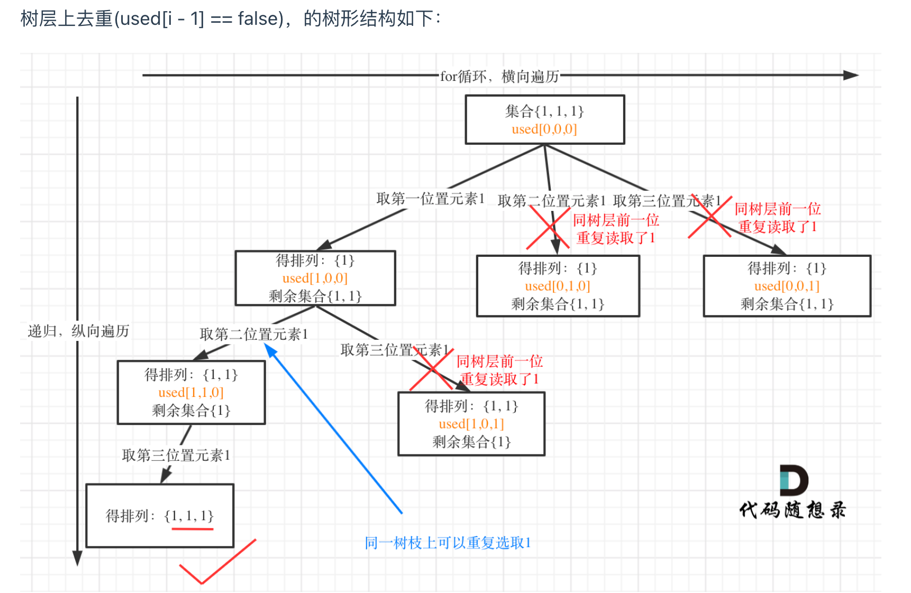
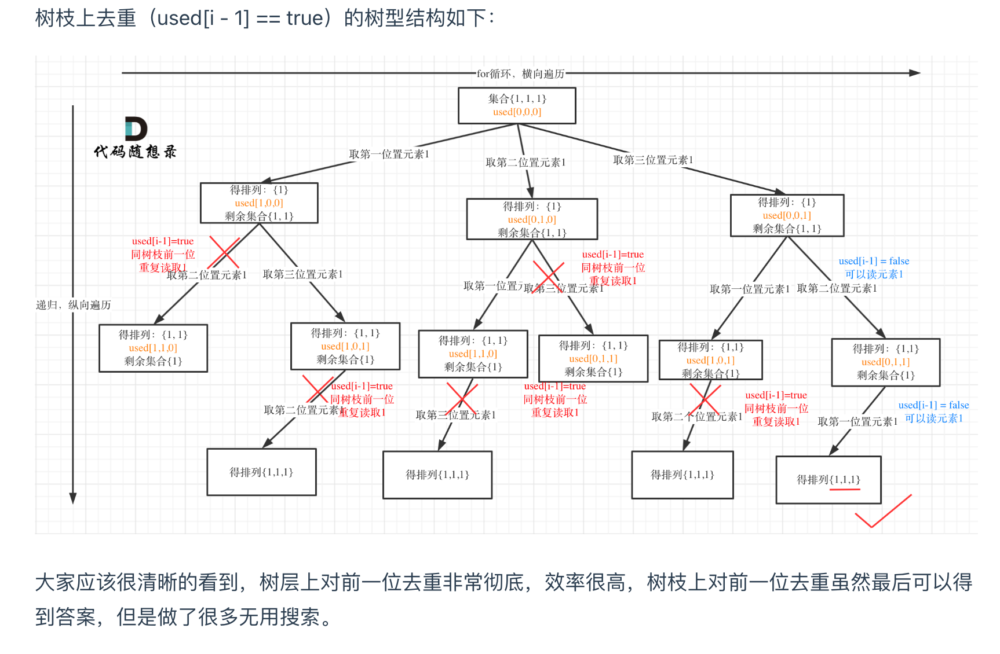

# [Permutations II - LeetCode](https://leetcode.com/problems/permutations-ii/description/)
## Tag
#permutations, #backtracking， #removeduplicate


## 审题（关键词） 
全排列，可重复


## 初始思路  
全排列题型，但是考虑重复元素
如何去重？树层去重，先排序，树层上元素相同进行去重


## 考点  
树层去重，全排列，重复元素


## 解法  
```java
class Solution {
    public List<List<Integer>> permuteUnique(int[] nums) {
       boolean[] used = new boolean[nums.length];
        List<List<Integer>> ans = new ArrayList<>();
        List<Integer> path = new ArrayList<>();
        Arrays.sort(nums);

        // 参数：除基本外，使用used数组代替startIndex，
        // 因为本题排列是有序的，这意味着同一层的元素可以重复使用，但同一树枝上不能重复使用
        // 所以处理排列问题每层都需要从头搜索，故不再使用start_index
        // 增加树层去重的逻辑
        backTracking(nums, ans, path, used);
        return ans;
    }

    void backTracking(int[] nums, List<List<Integer>> ans, List<Integer> path, boolean[] used) {
        // 终止：path的长度和nums相等，全排列
        if (nums.length == path.size()) {
            ans.add(new ArrayList<>(path));
        }

        // for loop 遍历选择
        // 选择列表：不在used里的num
        for (int i = 0; i < nums.length; i++) {
            if(used[i]) {
                // 排除选择过的元素，
                continue;
            }
            if (i > 0 && nums[i] == nums[i - 1] && !used[i - 1]) {
                // 树层去重
                continue;
            }
            // 未被选择过的，在选择列表内：
            // inOrder:
            // update used and path
            used[i] = true;
            path.add(nums[i]);

            backTracking(nums, ans, path, used);

            // postOrder:
            // backtracking
            path.remove(path.size() - 1);
            used[i] = false;
            
        }
    }
}
```

## 难点
去重一定要对元素进行排序，这样我们才方便通过相邻的节点来判断是否重复使用了。

### 树层去重和树枝去重的比较：



### 结果
- 组合问题和排列问题答案是在树形结构的叶子节点上收集结果，
- 而子集问题就是取树上所有节点的结果。