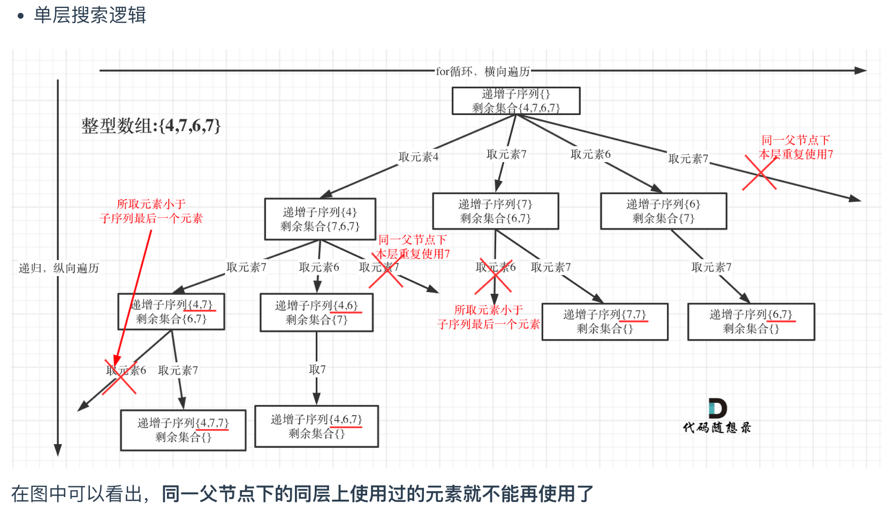

> 如何不排序去重，树层去重
# [Non-decreasing Subsequences - LeetCode](https://leetcode.com/problems/non-decreasing-subsequences/description/)
## Tag
#combination, #subset, #subsequence, #removeduplicate

## 审题（关键词） 
 all the different possible, non-decreasing subsequences

## 初始思路  
 关键词：所有可能，子序列，需要暴力搜索，可以往回溯方向思考。
 
 
## 考点 
子序列，  
- 如何保证非递减？前序遍历位置判断是否满足非递减 
- 如何去重？不提前排序的情况下，使用一个hashset或者array来进行记录，相同的去掉剪枝  


## 解法  
```java
class Solution {
    public List<List<Integer>> findSubsequences(int[] nums) {
        // 回溯算法
        // 参数：
        // nums
        // startIndex
        // ans, path
        List<List<Integer>> ans = new ArrayList<>();
        List<Integer> path = new ArrayList<>();
        
        backTracking(nums, ans, path, 0);
        return ans;
    }

    void backTracking(  
        int[] nums, 
        List<List<Integer>> ans,
        List<Integer> path, 
        int startIndex) {
            // 答案：所有的有效节点
            if (path.size() >= 2) {
                ans.add(new ArrayList<>(path));
            }

            // 终止条件：超出index
            if (startIndex >= nums.length) {
                return; 
            }

            // 201个元素，记录重复，做树层去重
            int[] used = new int[201]; 
            // for loop, 遍历所有选择列表：
            for (int i = startIndex; i < nums.length; i++) {
                // preOrder position:
                // 剪枝：不满足非递减，树层元素重复（去重）
                int index = nums[i] + 100;
                if (path.size() > 0 && nums[i] < path.get(path.size() - 1) || used[index] >= 1) {
                    continue;
                }
                // 更新记录：
                used[index]++;
                path.add(nums[i]);

                backTracking(nums, ans, path, i + 1);

                // postOrder: 回溯
                path.remove(path.size() - 1);
            }
    }
}
```

## 难点
理解树层去重的概念，不排序去重  
去重的位置：for循环内部，preorder  
