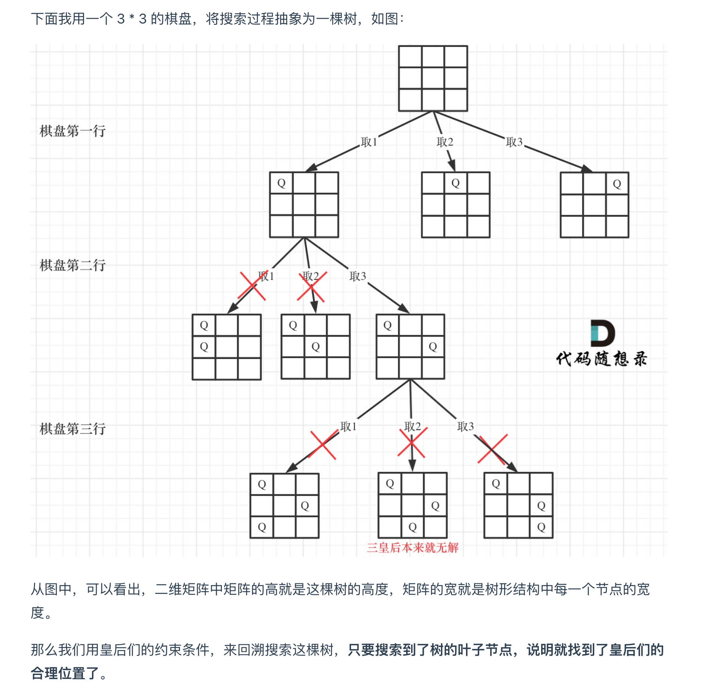

# [N-Queens - LeetCode](https://leetcode.com/problems/n-queens/description/)
## Tag
#backtracking, #board


## 审题（关键词）
N皇后，distinct solution, any order answer


## 初始思路  
需要得到所有的N皇后可能答案，  
需要暴力的搜索皇后的放置位置，   
使用回溯，逐行遍历   
- 路径就是整个棋盘  
- 剪枝： 皇后不能同行同列，不能斜角     

## 考点  
回溯，路径为整个棋盘

## 解法  

```java
class Solution {
    List<List<String>> ans = new ArrayList<>();

    public List<List<String>> solveNQueens(int n) {
        boolean[][] board = new boolean[n][n];

        // 回溯算法，
        // 参数： 
        // n : n个皇后，亦是棋盘大小
        // 路径: 整个棋盘
        // col: 当前的行
        backTracking(board, n, 0);
        return ans;
    }

    void backTracking(boolean[][] board, int n, int row) {
        // 终止条件：
        // 所有行递归完毕，找到一个可行解
        if (row >= n) {
            ans.add(draw(board));
            return;
        }


        // for loop 遍历选择列表
        // 遍历当前行所有位置，可行的位置放入queen，去下一行递归
        for (int i = 0; i < n; i++) {
            // trim invalid position
            if (!isValid(board, row, i)){
                continue;
            }

            // preOrder:
            // update path(board) and row
            board[row][i] = true;

            // recursion:
            // go to next row
            backTracking(board, n, row + 1);

            // postOrder:
            // backTracking
            board[row][i] = false;
        }
    }

    boolean isValid(boolean[][] board, int row, int col) {
        int n = board.length;
        // 向上找
        for (int i = row; i >= 0; i-- ) {
            if (board[i][col]) {
                return false;
            }
        }

        // 左上：
        for (int i = row, j = col; i >= 0 && j >= 0; i--, j--) {
            if (board[i][j]){
                return false;
            }
        }

        // 右上：
        for (int i = row, j = col; i >= 0 && j < n; i--, j++) {
            if (board[i][j]){
                return false;
            }
        }

        return true;
    }


    List<String> draw(boolean[][] board) {
        List<String> boardStr = new ArrayList<>();

        
        for (int i = 0; i < board.length; i++) {
            StringBuilder sb = new StringBuilder();
            for (int j = 0; j < board[0].length; j++) {
                if (board[i][j]) {
                    sb.append("Q");
                } else {
                    sb.append('.');
                }
            }
            boardStr.add(sb.toString());
        }
        return boardStr;
    }
}
```

## 难点
二维递归回溯，习惯处理二维数组。
