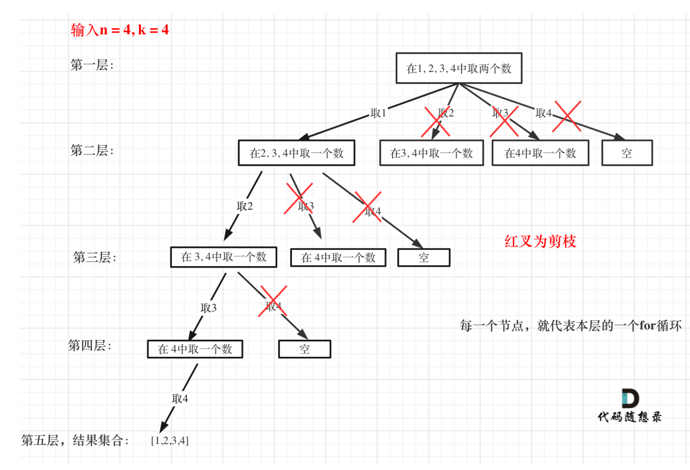

# [Combinations - LeetCode](https://leetcode.com/problems/combinations/description/)
## Tag
#backtracking, #combinations


## 审题（关键词） 
all combinations, n size


## 初始思路
使用递归回溯的思考框架：
1. 参数：路径，选择列表，startindex
2. 终止条件： 路径size为n
3. 遍历： 列表中选择一个element，放入路径
4. 回溯：撤回选择

## 考点  
backtracking, 剪枝

## 解法 
> 非剪枝版本
```java
class Solution {
    public List<List<Integer>> combine(int n, int k) {
        List<List<Integer>> ans = new ArrayList<>();
        List<Integer> path = new ArrayList<>();
        backtracking(1, n, k, path, ans);
        return ans;
    }

    private void backtracking(int startIndex, int n, int k, List<Integer> path, List<List<Integer>> ans) {
        // 终止条件：找到了一个size k的组合
        // 叶子节点的路径就是一个找到了的组合。
        if (path.size() == k) {
            ans.add(new ArrayList<>(path));
        }

        // path 和 startIndex 相当于维护了这个节点的状态：
        // 走过来的路径，以及剩余的选择列表(组合不重复取元素)。
       
        // 选择列表：1 ~ n
        for (int i = startIndex; i <= n; i++) {
            // 处理(树枝)：做选择
            // update path and start Index
            path.add(i);

             // 访问：
            backtracking(i+1, n, k, path, ans);

            // 处理(树枝)：撤销选择
            // 回溯：remove the last element.
            // 回溯在for循环内部，每次做完选择都要撤销。
            path.remove(path.size() - 1);
        }        
    }
}
```
> 剪枝  
> 如果for循环选择的起始位置之后的元素个数 已经不足 我们需要的元素个数了，那么就没有必要搜索了。

```java
class Solution {
    public List<List<Integer>> combine(int n, int k) {
        List<List<Integer>> ans = new ArrayList<>();
        List<Integer> path = new ArrayList<>();
        backtracking(1, n, k, path, ans);
        return ans;
    }

    private void backtracking(int startIndex, int n, int k, List<Integer> path, List<List<Integer>> ans) {
        // 终止条件：找到了一个size k的组合
        // 叶子节点的路径就是一个找到了的组合。
        if (path.size() == k) {
            ans.add(new ArrayList<>(path));
            return ;
        }

        // path 和 startIndex 相当于维护了这个节点的状态：
        // 走过来的路径，以及剩余的选择列表(组合不重复取元素)。
       
        // 选择列表：1 ~ n
        // 剪枝： 后面的元素个数不足做出选择：仍需要： k - path.size()个元素。
        for (int i = startIndex; i <= n - (k - path.size()) + 1; i++) {
            // 前序处理(树枝)：做选择
            // update path and start Index
            path.add(i);

             // 访问：
            backtracking(i+1, n, k, path, ans);

            // 后序处理(树枝)：撤销选择
            // 回溯：remove the last element.
            // 回溯在for循环内部，每次做完选择都要撤销。
            path.remove(path.size() - 1);
        }        
    }
}
```
## 难点
组合如何进行选择