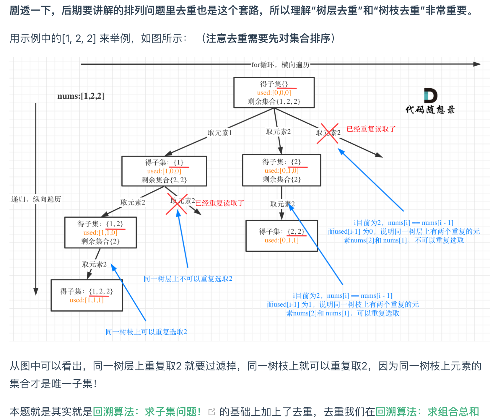

# [Subsets II - LeetCode](https://leetcode.com/problems/subsets-ii/description/)
## Tag
#combination, #subset

## 审题（关键词） 
子集组合，会有重复元素

## 初始思路  
如何去重？可见组合总和2, [[40. Combination Sum II]]

## 考点  

## 解法  

```java
class Solution {
    public List<List<Integer>> subsetsWithDup(int[] nums) {
        Arrays.sort(nums);
        List<Integer> path = new ArrayList<>();
        List<List<Integer>> ans = new ArrayList<>();
        boolean[] used = new boolean[nums.length];

        backTracking(nums, path, ans, used, 0);
        return ans;
    }


    void backTracking(int[] nums, List<Integer> path, List<List<Integer>> ans, boolean[] used, int startIndex) {
        // 处理：所有的节点都是答案
        ans.add(new ArrayList<>(path));

        if (startIndex >= nums.length) {
            return ;
        }
        // for 循环 遍历选择列表
        for (int i = startIndex; i < nums.length; i++) {
            // 树层去重，如果i于i-1元素相等，且前一个元素在本路径上没用过（之前已经有类似的组合了）
            // 1, 1, 7 -> 1, 7 去重
            if (i > 0 && nums[i] == nums[i - 1] && !used[i - 1]) {
                continue;
            }

            path.add(nums[i]);
            used[i] = true;
            backTracking(nums, path, ans, used, i + 1);
            path.remove(path.size() - 1);
            used[i] = false;
        }
    }
}
```

## 难点
去重

```java
// 树层去重，如果i于i-1元素相等，且前一个元素在本路径上没用过（之前已经有类似的组合了）
// 1, 1, 7 -> 1, 7 去重
if (i > 0 && nums[i] == nums[i - 1] && !used[i - 1]) {
    continue;
}

// 本题也可以不使用used数组来去重，因为递归的时候下一个startIndex是i+1而不是0。
// 如果要是全排列的话，每次要从0开始遍历，为了跳过已入栈的元素，需要使用used。
if (i > startIndex && nums[i] == nums[i - 1] ) {
	continue;
}
```