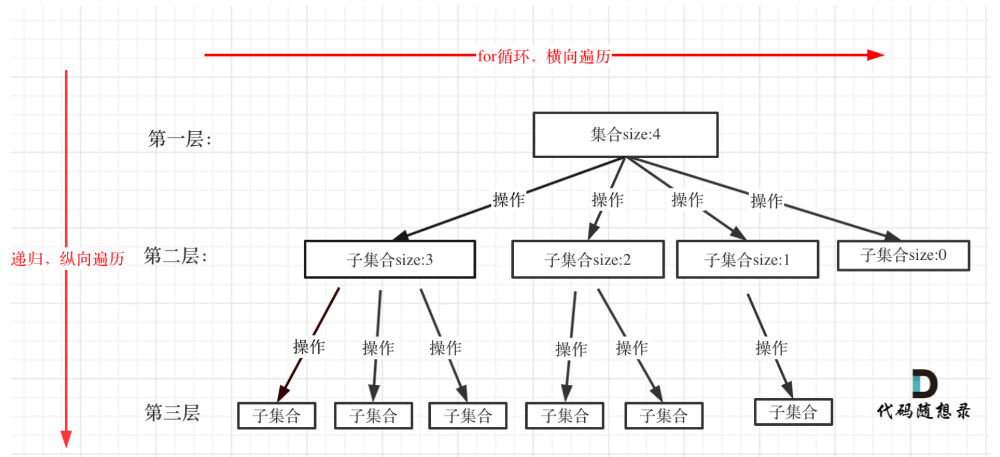

# 回溯
## 如何理解回溯：

> for循环可以理解是横向遍历，backtracking（递归）就是纵向遍历，这样就把这棵树全遍历完了，一般来说，搜索叶子节点就是找的其中一个结果了。  
 
## template: 
```java
void backtracking(参数) {
    if (终止条件) {
        存放结果;
        return;
    }

    for (选择：本层集合中元素（树中节点孩子的数量就是集合的大小）) {
        处理节点;
        backtracking(路径，选择列表); // 递归
        回溯，撤销处理结果
    }
}
```