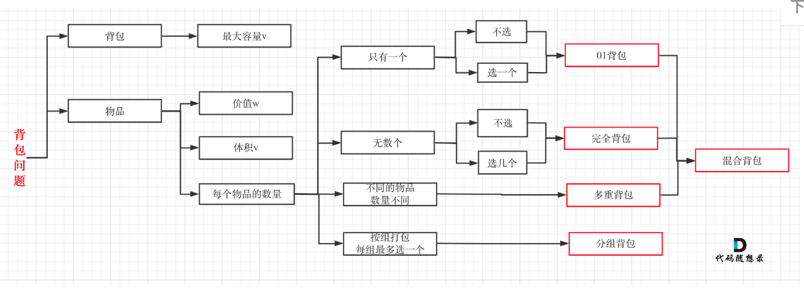

## 背包类问题：
[背包总结](https://programmercarl.com/%E8%83%8C%E5%8C%85%E6%80%BB%E7%BB%93%E7%AF%87.html#%E8%83%8C%E5%8C%85%E9%80%92%E6%8E%A8%E5%85%AC%E5%BC%8F)
### 总纲：
1. 确定dp数组（dp table）以及下标的含义
2. 确定递推公式
3. dp数组如何初始化
4. 确定遍历顺序
   1. 组合问题
      - 如果求组合数就是外层for循环遍历物品，内层for遍历背包。
      - 先放入物品1， 再放入物品2，所以只能 1， 2， 不能 2， 1
   2. 排列问题
      - 如果求排列数就是外层for遍历背包，内层for循环遍历物品。
      - 每个容量下都放了1，2。之后的容量会在这个基础上继续加1， 2
5. 举例推导dp数组

### 题型：
> 问能否能装满背包（或者最多装多少）：  
> - dp[j] = max(dp[j], dp[j - nums[i]] + nums[i]); 
1. 416.分割等和子集(opens new window) [[416. Partition Equal Subset Sum]]
2. 1049.最后一块石头的重量 II [[1049. Last Stone Weight II]]

> 问装满背包有几种方法：
> - dp[j] += dp[j - nums[i]] 

- 494.目标和(opens new window) [[494. Target Sum]]
- 518.零钱兑换 II(opens new window) [[518. Coin Change II]]
- 377.组合总和Ⅳ(opens new window) [[377. Combination Sum IV]]
- 70.爬楼梯进阶版（完全背包）(opens new window) [[70. Climbing Stairs]]

> 问背包装满最大价值：
> - dp[j] = max(dp[j], dp[j - weight[i]] + value[i]); 

- 474.一和零(opens new window) [[474. Ones and Zeroes]]

> 问装满背包所有物品的最小个数：
> - dp[j] = min(dp[j - coins[i]] + 1, dp[j]); ，对应题目如下：

- 322.零钱兑换(opens new window) [[322. Coin Change]]
- 279.完全平方数(opens new window) [[279. Perfect Squares]]

---

### 01背包 [[0-1knapsack]]

- 二维dp数组01背包先遍历物品还是先遍历背包都是可以的，且第二层for循环是从小到大遍历。（[01背包理论基础](https://programmercarl.com/%E8%83%8C%E5%8C%85%E7%90%86%E8%AE%BA%E5%9F%BA%E7%A1%8001%E8%83%8C%E5%8C%85-1.html)）
- 一维dp数组01背包只能先遍历物品再遍历背包容量，且第二层for循环是从大到小遍历。（[01背包理论基础（滚动数组）](https://programmercarl.com/%E8%83%8C%E5%8C%85%E7%90%86%E8%AE%BA%E5%9F%BA%E7%A1%8001%E8%83%8C%E5%8C%85-2.html#%E4%B8%80%E7%BB%B4dp%E6%95%B0%E7%BB%84-%E6%BB%9A%E5%8A%A8%E6%95%B0%E7%BB%84)）

### 完全背包：[[完全背包]]
如果求组合数就是外层for循环遍历物品，内层for遍历背包。
求组合数：
- 动态规划：518.零钱兑换II (opens new window) [[518. Coin Change II]]

如果求排列数就是外层for遍历背包，内层for循环遍历物品。
- 动态规划：377. 组合总和 Ⅳ (opens new window)、 [[377. Combination Sum IV]]
- 动态规划：70. 爬楼梯进阶版（完全背包） (opens new window) [[70. Climbing Stairs]]

求最小，for循环顺序无所谓：
- 动态规划：322. 零钱兑换 (opens new window)、[[322. Coin Change]]
- 动态规划：279.完全平方数 [[279. Perfect Squares]]

## 子序列问题
1. 单个字符串比较加条件：最长递增(子序列，子数组)
   1. LIS 
      1. [[300. Longest Increasing Subsequence]]
   2. 子数组（连续子序列） [[674. Longest Continuous Increasing Subsequence]]
2. 两个字符串比较穷举问题：比较最长重复，最长公共：
   1. [[718. Maximum Length of Repeated Subarray]]
   2. LCS:
      1. [[1143. Longest Common Subsequence]]
      2. [[1035. Uncrossed Lines]]

## 编辑距离系列问题
1. [[392. Is Subsequence]]
   1. 给定字符串 s 和 t ，判断 s 是否为 t 的子序列
   2. 只需要计算删除的情况，不用考虑增加和替换的情况
2. [[115. Distinct Subsequences]]
   1. 给定一个字符串 s 和一个字符串 t ，计算在 s 的子序列中 t 出现的个数
   2. 只有删除操作，不用考虑替换增加之类
   3. 即使字符串相等匹配，也要考虑留下、不留下该字符串的情况 [[115. Distinct Subsequences#难点]]
3. [[583. Delete Operation for Two Strings]] 
   1. 跟115比两个字符串都可以删除[[583. Delete Operation for Two Strings#解法2：]]
4. [[72. Edit Distance#初始思路]]
   1. 考虑删除，替换，增加三个操作，求最小值。
