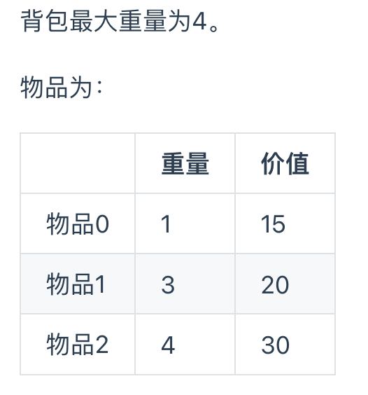
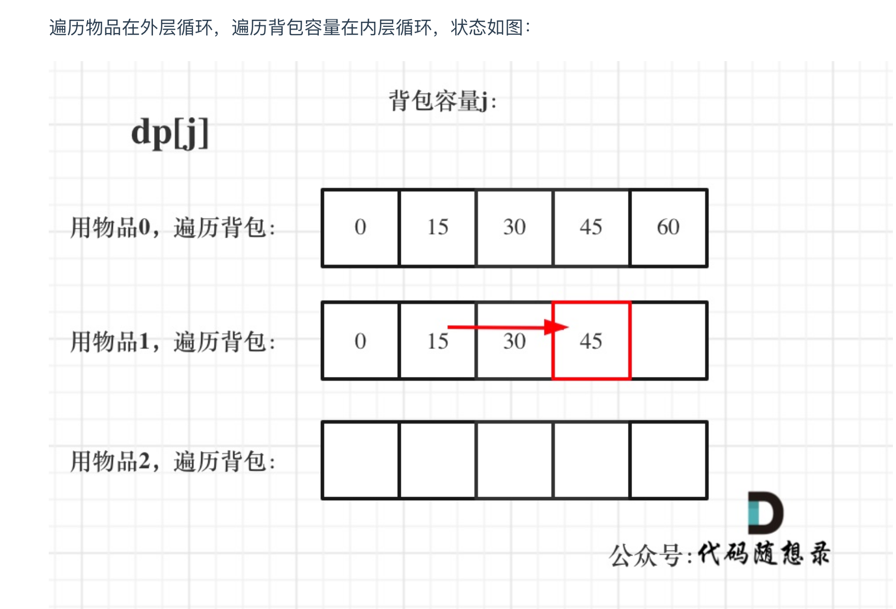
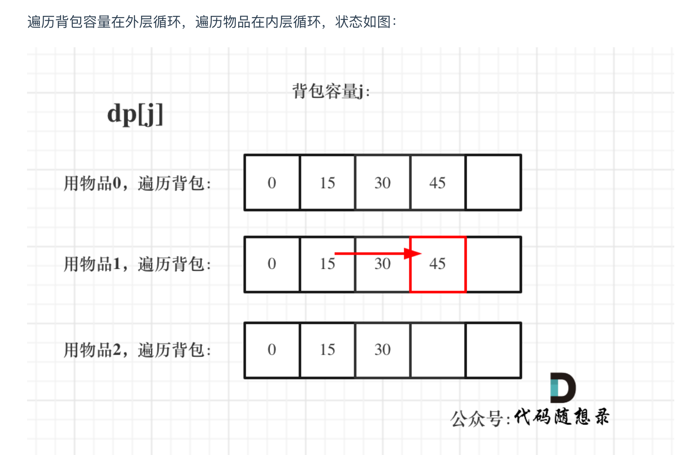

# [完全背包](https://programmercarl.com/%E8%83%8C%E5%8C%85%E9%97%AE%E9%A2%98%E7%90%86%E8%AE%BA%E5%9F%BA%E7%A1%80%E5%AE%8C%E5%85%A8%E8%83%8C%E5%8C%85.html#%E5%AE%8C%E5%85%A8%E8%83%8C%E5%8C%85)
## Tag
#Knapsack, #dp  

[代码随想录](https://programmercarl.com/%E8%83%8C%E5%8C%85%E9%97%AE%E9%A2%98%E7%90%86%E8%AE%BA%E5%9F%BA%E7%A1%80%E5%AE%8C%E5%85%A8%E8%83%8C%E5%8C%85.html#%E5%AE%8C%E5%85%A8%E8%83%8C%E5%8C%85)


## 审题（关键词） 
有N件物品和一个最多能背重量为W的背包。第i件物品的重量是weight[i]，得到的价值是value[i] 。  
每件物品都有无限个（也就是可以放入背包多次），求解将哪些物品装入背包里物品价值总和最大。



## 初始思路  
在完全背包中，对于一维dp数组来说，其实两个for循环嵌套顺序是无所谓的！
for循环背包时，使用正序遍历：[[0-1knapsack]]




## 考点  
1. 遍历顺序 [[518. Coin Change II#难点]]
2. 确定loop顺序
   - 如果求组合数就是外层for循环遍历物品，内层for遍历背包。
   - 如果求排列数就是外层for遍历背包，内层for循环遍历物品。
3. 确定背包重量的遍历顺序：
   - [[0-1knapsack#Questions]]
   - 本题需要顺序
     - 以物品1为例，dp[3]可以dp[2] + v[1]得到, dp[2] 由dp[1] + v[1] 得到， 物品1就用来两次


## 解法  
```java
//先遍历物品，再遍历背包
private static void testCompletePack(){
    int[] weight = {1, 3, 4};
    int[] value = {15, 20, 30};
    int bagWeight = 4;
    int[] dp = new int[bagWeight + 1];
    for (int i = 0; i < weight.length; i++){ // 遍历物品
        for (int j = weight[i]; j <= bagWeight; j++){ // 遍历背包容量
            dp[j] = Math.max(dp[j], dp[j - weight[i]] + value[i]);
        }
    }
    for (int maxValue : dp){
        System.out.println(maxValue + "   ");
    }
}

//先遍历背包，再遍历物品
private static void testCompletePackAnotherWay(){
    int[] weight = {1, 3, 4};
    int[] value = {15, 20, 30};
    int bagWeight = 4;
    int[] dp = new int[bagWeight + 1];
    for (int i = 1; i <= bagWeight; i++){ // 遍历背包容量
        for (int j = 0; j < weight.length; j++){ // 遍历物品
            if (i - weight[j] >= 0){
                dp[i] = Math.max(dp[i], dp[i - weight[j]] + value[j]);
            }
        }
    }
    for (int maxValue : dp){
        System.out.println(maxValue + "   ");
    }
}
```

## 难点
