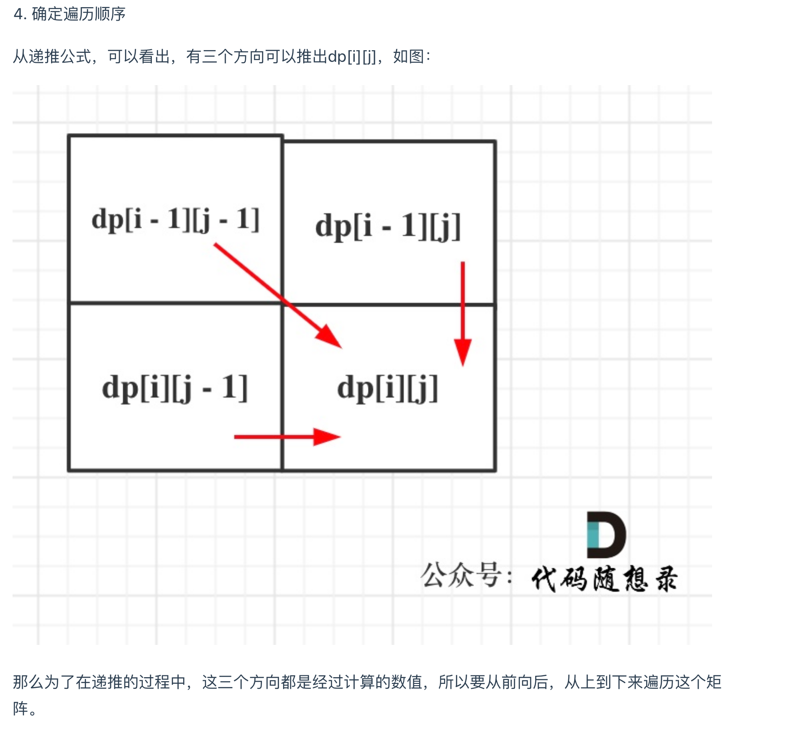

# [Longest Common Subsequence - LeetCode](https://leetcode.com/problems/longest-common-subsequence/)
# Tag
#LCS, #dp


## 审题（关键词） 
给定两个字符串 text1 和 text2，返回这两个字符串的最长公共子序列的长度。


## 初始思路  
两个数组，求最长的公共子序列。  
最长表示要穷举获得。  
如何获得两个数组的公共序列？  
两个字符串比较的穷举题目： [[718. Maximum Length of Repeated Subarray]]


## 考点  
```
子序列问题且要穷举，符合dp穷举加剪枝的思路。  
只要涉及子序列问题，可以往这个方向想。  

解决这类问题需要一个二维数组。  
二维数组可以用来记录两个字符串的所有情况。  

状态就是i,j 分别是两个数组的index
选择就是：aray1 和array2 在LCS数组上是否有字符，要么在，要么不在。

1. text1[i - 1] 与 text2[j - 1]相同: 
    找到一个公共元素
	dp[i][j] = dp[i - 1][j - 1] + 1;
	
2. text1[i - 1] 与 text2[j - 1]不相同: 
    看取i-1 公共子序列大还是j-1 公共子序列大
	dp[i][j] = max(dp[i - 1][j], dp[i][j - 1]);
	
```


## 解法  
```java
class Solution {
    public int longestCommonSubsequence(String text1, String text2) {
        int txt1_len = text1.length();
        int txt2_len = text2.length();
        // dp的定义：dp[i][j] 的含义是：对于 s1[1..i] 和 s2[1..j]，它们的 LCS 长度是 dp[i][j]。
        // 状态： i和j两个index
        // 选择：i和j的character有没有被选中在LCS中， 
        // 转移：i和j的character相等则选中，不相等则至少有一个不在公共子序列中。
        // 结果：dp[i][j]
        // 初始化为0
        int[][] dp = new int[txt1_len + 1][txt2_len + 1];

        for (int i = 1; i <= txt1_len; i++) {
            for (int j = 1; j <= txt2_len; j++) {
                char a = text1.charAt(i - 1);
                char b = text2.charAt(j - 1);
                // case 1 : 相等：
                if (a == b) {
                    // 当前的character被选中，在LCS中
                    dp[i][j] = dp[i - 1][j - 1] + 1;
                } else {
                    // case 2 : 不相等
                    // 当前的characters没有被选中，不在LCS中，穷举之后的两个请况：
                    dp[i][j] = Math.max(dp[i - 1][j], dp[i][j - 1]);
                }
            }
        }
        return dp[txt1_len][txt2_len];
    }
```
