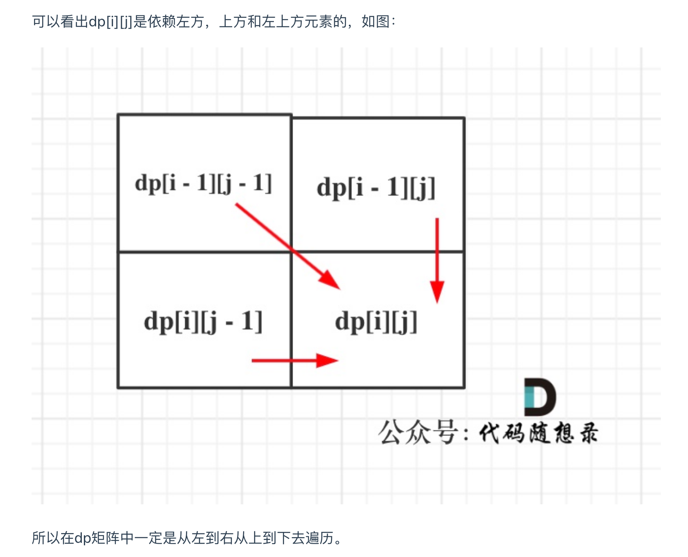

# [Edit Distance - LeetCode](https://leetcode.com/problems/edit-distance/)
## 审题（关键词） 
#edit_distance, #LCS
## 编辑距离总结
一步步到这题：
1. [[392. Is Subsequence]]
   1. 给定字符串 s 和 t ，判断 s 是否为 t 的子序列
   2. 只需要计算删除的情况，不用考虑增加和替换的情况
2. [[115. Distinct Subsequences]]
   1. 给定一个字符串 s 和一个字符串 t ，计算在 s 的子序列中 t 出现的个数
   2. 只有删除操作，不用考虑替换增加之类
   3. 即使字符串相等匹配，也要考虑留下、不留下该字符串的情况 [[115. Distinct Subsequences#难点]]
3. [[583. Delete Operation for Two Strings]] 
   1. 跟115比两个字符串都可以删除[[583. Delete Operation for Two Strings#解法2：]]
4. [[72. Edit Distance]] 本题


## 初始思路 

1. dp[i][j] 表示以下标i-1为结尾的字符串word1，和以下标j-1为结尾的字符串word2，最近编辑距离为dp[i][j]。
2. 状态转移：
    ```java
    if s1[i] == s2[j]:
        啥都别做（skip）
        i, j 同时向前移动
    else:
        三选一：
            插入（insert）
                word2添加一个元素，相当于word1删除一个元素，  
                例如 word1 = "ad" ，word2 = "a"，
                word1删除元素'd' 和 word2添加一个元素'd'，
                变成word1="a", word2="ad"， 最终的操作数是一样
            删除（delete）
            替换（replace）
    ```
3. 初始化：
   1. dp[i][0] ：以下标i-1为结尾的字符串word1，和空字符串word2，最近编辑距离为dp[i][0]。
4. 遍历顺序：
   1. 


## 考点  
如果使用自底向上的迭代解法，这样定义 dp 数组：dp[i-1][j-1] 存储 s1[0..i] 和 s2[0..j] 的最小编辑距离。dp 数组索引至少是 0，所以索引会偏移一位。

## 解法  
```java
class Solution {
    public int minDistance(String word1, String word2) {
        int word1_len = word1.length();
        int word2_len = word2.length();

        // 长度需要加1 因为需要记录空字符串
        int[][] dp = new int[word1_len + 1][word2_len + 1];

        // base case, one word has been iterate through, but the other one is not.
        // need extra steps to remove/insert characters(equal to i)
        for (int i = 1; i < word1_len + 1; i++) {
            dp[i][0] = i;
        }

        for (int i = 1; i < word2_len + 1; i++) {
            dp[0][i] = i;
        }

        // insert: j will move forward: from (j - 1) -> j, and minDistance equal to dp[i][j - 1] plus 1
        // remove: i will move forward: from (i - 1) -> i, and minDistance equal to dp[i - 1][j] plus 1
        for(int i = 1; i < word1_len + 1; i++) {
            for (int j = 1; j < word2_len + 1; j++) {
                char a = word1.charAt(i - 1);
                char b = word2.charAt(j - 1);
                // two characters same, skip this step
                if (a == b) {
                    dp[i][j] = dp[i - 1][j - 1];
                } else {
                    // if characters are not same, there are three actions:
                    dp[i][j] = min(
                        dp[i - 1][j] + 1, // remove word1[i - 1]
                        dp[i][j - 1] + 1, // remove word2[j - 1](insert word1) 
                        dp[i - 1][j - 1] + 1 // replace
                    );
                }


            }
        }

        return dp[word1_len][word2_len];
    }

    private int min(int a, int b, int c) {
        return Math.min(a, Math.min(b, Math.min(b, c)));
    }
}

```
