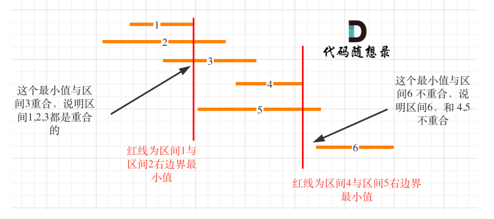

# [Non-overlapping Intervals - LeetCode](https://leetcode.com/problems/non-overlapping-intervals/description/)
## Tag
#greedy, #overlapping

## 审题（关键词） 
给一些区间，返回最少区间数，移除后区间之间没有覆盖


## 初始思路  
贪心思路：重叠区间之间保留右边界最小的区间。
1. 删除哪些重叠的区间？
   1. 这个问题可以反向思考：重叠之间保留谁？肯定保留右边界最小的，这样之后的区间才能尽可能多的不重叠
   2. 那么怎么保留右边界最小的？先按照右边界排序，保留第一个区间即可。
2. 删除多少（答案）：有多少重叠的删除多少，使用count记录重叠。

## 考点  
和[[452. Minimum Number of Arrows to Burst Balloons]]很像，弓箭数是非交叉区间数，本题是求交叉区间数
## 解法  

```java
class Solution {
    public int eraseOverlapIntervals(int[][] intervals) {
        // 按照右边界排序
        Arrays.sort(intervals, (a, b) -> a[1] - b[1]);

        // 记录重叠的区间
        int count = 0;
        // 记录重叠区间最小右边界所在index
        int curr = 0;
        for (int i = 1; i < intervals.length; i++) {
            // 比较后者的左边界和当前的右边界(最小)，如果有重叠，计数加1
            if (intervals[i][0] < intervals[curr][1]) {
                count++;
            } else {
                // 如果没有重叠，更新当前右边界：
                curr = i;

            }
        }

        return count;
    }
}
```

## 难点
