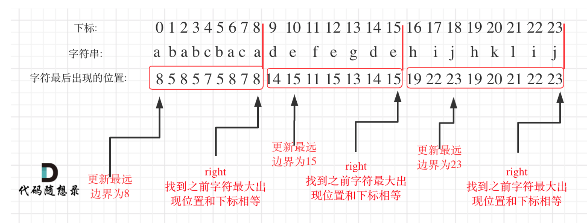

# [Partition Labels - LeetCode](https://leetcode.com/problems/partition-labels/description/)
- [代码随想录](https://programmercarl.com/0763.%E5%88%92%E5%88%86%E5%AD%97%E6%AF%8D%E5%8C%BA%E9%97%B4.html#%E5%85%B6%E4%BB%96%E8%AF%AD%E8%A8%80%E7%89%88%E6%9C%AC)
## Tag
#greedy, #overlapping


## 审题（关键词）
partition string, 尽量多，每个letter只在一个区间出现。

## 初始思路  
- 每个letter只在一个区间出现， 如何表示？
  - 只需要知道每个letter最后一次出现的位置，那里就是需要切割的地方, 即抵达当前最远的右边界,保证这段重叠区间全在右边界的左边。
- 如果有一个新的letter出现（before上一个letter)，且最后一次出现的位置更远，如何办？
  - 更新这个切割的位置，直到最远位置没有被更新了。


转换为区间问题，每个字母的开始和结束代表一个区间，保证切割线在当前重叠区间的最右边线即可。

## 考点  

## 解法  

```java
class Solution {
    public List<Integer> partitionLabels(String s) {
        List<Integer> ans = new ArrayList<>();
        if (s.length() <= 1) {
            ans.add(1);
            return ans;
        }

        int[] lastPositions = new int[27];

        for (int i = 0; i < s.length(); i++) {
            int currInd = s.charAt(i) - 'a';
            // 记录每个字母的最后出现位置
            lastPositions[currInd] = Math.max(lastPositions[currInd], i);
        }

        int start = 0;
        int mostLeftSide = lastPositions[s.charAt(0) - 'a'];

        for (int i = 0; i < s.length(); i++) {
            int currInd = s.charAt(i) - 'a';
            // 更新当前重叠区间最右边界。
            if (lastPositions[currInd] > mostLeftSide) {
                mostLeftSide = lastPositions[currInd];
            }

            // 找到当前最右边界
            if ( i == mostLeftSide) {
                // 此处分割
                ans.add(i - start + 1);
                start = i + 1;
            }
        }

        return ans;
    }
}
```

## 扩展
统计字符串中所有字符的起始和结束位置，记录这些区间(实际上也就是[[435. Non-overlapping Intervals]] (opens new window)题目里的输入)，将区间按左边界从小到大排序，找到边界将区间划分成组，互不重叠。找到的边界就是答案。
```java
    public  List<Integer> partitionLabels(String s) {
        int[][] partitions = findPartitions(s);
        List<Integer> res = new ArrayList<>();
        Arrays.sort(partitions, (o1, o2) -> Integer.compare(o1[0], o2[0]));
        int right = partitions[0][1];
        int left = 0;
        for (int i = 0; i < partitions.length; i++) {
            if (partitions[i][0] > right) {
                //左边界大于右边界即可记录一次分割
                res.add(right - left + 1);
                left = partitions[i][0];
            }
            right = Math.max(right, partitions[i][1]);

        }
        //最右端
        res.add(right - left + 1);
        return res;

    }
```